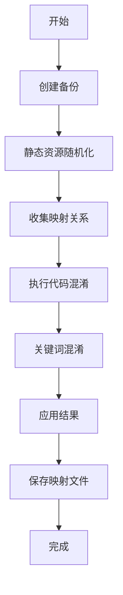

# 前端代码混淆工具

一个强大的前端代码混淆工具，支持 JavaScript、TypeScript、HTML、CSS 的全方位混淆。

## 功能特性

### 🚀 核心混淆功能
1. **代码函数名、变量名、类名、ID名替换**
2. **增加垃圾代码 + 30%**
3. **代码结构混淆**
4. **静态资源随机化** ✨ **新功能**
5. **代码对比，相似度低于10%**

### 🎯 支持的文件类型
- **JavaScript** (.js) - 高级混淆，支持ES6+
- **TypeScript** (.ts, .tsx) - 类型安全的混淆
- **HTML** (.html) - DOM结构和内联代码混淆
- **CSS** (.css) - 选择器和样式混淆

### 🔧 静态资源随机化功能 ✨

在原有代码混淆基础上，新增了文件结构随机化功能：

#### 文件结构随机化
- **目录结构重组**: 将原始目录结构打散重组为随机目录
- **文件路径随机化**: 静态资源文件随机分布到新目录中
- **文件名混淆**: 对可重命名文件生成随机文件名
- **引用自动更新**: 自动更新所有文件中的路径引用

#### 智能保护机制
- **重要文件保护**: 自动识别并保护重要文件（如 index.html）
- **第三方库保护**: 跳过 node_modules 等第三方库目录
- **配置文件保护**: 保护 package.json 等配置文件

### 🔤 关键词混淆功能 ✨

针对HTML文件中的敏感关键词进行深度混淆：

#### 多重混淆方式
- **Span标签包装**: 将关键词拆分为多个span标签 `<span>外</span><span>汇</span>`
- **随机属性注入**: 添加随机class、id、data属性 `<span class="fx-key">投</span>`
- **不可见字符插入**: 使用零宽字符等不可见字符 `外&#8203;汇&#8205;交&#8288;易`
- **混合模式**: 组合多种混淆方式达到最佳效果

#### 智能识别
- **自动加载关键词**: 从 `key.txt` 文件加载关键词列表
- **全长度处理**: 处理所有长度的关键词，包括2字符的短关键词
- **精确HTML标签检测**: 智能识别HTML标签和属性，避免错误混淆
- **重叠范围处理**: 防止关键词重叠导致的混淆错误
- **长度优先**: 优先处理长关键词避免子串冲突
- **强制混淆保证**: 确保每个关键词都被有效混淆，无遗漏
- **随机化处理**: 每次运行使用不同的混淆方式

## 安装和使用

### 安装依赖
```bash
pnpm install
```

### 运行混淆
```bash
# 基础用法
node ./bin/obfuscate.js ./demo

# 或者使用 npm script
npm start ./demo
```

## 混淆流程



### 详细流程说明

1. **备份阶段**
   - 创建原始文件备份
   - 建立工作目录

2. **静态资源随机化**
   - 扫描项目结构
   - 生成随机目录结构
   - 移动文件到新位置
   - 更新所有引用

3. **映射收集**
   - HTML: 收集类名和ID
   - CSS: 收集选择器
   - JS/TS: 收集全局变量和选择器引用

4. **代码混淆**
   - JavaScript: 高级混淆 + 控制流平坦化
   - TypeScript: 类型移除 + JavaScript混淆
   - HTML: DOM混淆 + 内联代码处理
   - CSS: 选择器替换 + 样式压缩

5. **关键词混淆** ✨ **新增**
   - 加载关键词列表
   - 多重混淆算法处理
   - span标签 + 不可见字符 + 随机属性

6. **结果应用**
   - 清空目标目录
   - 复制混淆结果
   - 生成映射文件

## 混淆配置

### JavaScript/TypeScript 混淆选项
```javascript
{
    // 基础配置
    compact: true,
    controlFlowFlattening: true,
    controlFlowFlatteningThreshold: 0.75,
    
    // 死代码注入
    deadCodeInjection: true,
    deadCodeInjectionThreshold: 0.4,
    
    // 字符串混淆
    stringArray: true,
    stringArrayEncoding: ['base64'],
    stringArrayThreshold: 0.8,
    
    // 标识符混淆
    identifierNamesGenerator: 'hexadecimal',
    identifiersPrefix: 'obf_',
    
    // 安全防护
    selfDefending: true,
    debugProtection: false
}
```

### HTML 混淆选项
```javascript
{
    hexEncode: true,        // 十六进制编码
    unicodeEncode: true,    // Unicode编码
    removeComments: true,   // 移除注释
    compressWhitespace: true // 压缩空白
}
```

### CSS 混淆选项
- 选择器替换
- 样式压缩
- 无用代码注入
- 注释移除

## 输出文件

### 混淆结果
- 混淆后的项目文件（覆盖原文件）
- 原始文件备份（`*_original_backup/`）

### 映射文件
生成 `obfuscation-mapping.json` 文件，包含：
```json
{
    "files": {
        "static/js/main.js": "app_a1b2c3/file_d4e5f6.js",
        "images/logo.png": "res_x1y2z3/asset_m7n8o9.png"
    },
    "globals": {
        "myFunction": "obf_f1g2h3"
    }
}
```

### 混淆效果示例

#### 关键词混淆效果
```html
<!-- 原始内容 -->
<title>片山晃 × 日本株メソッド | 本質×実践の投資講座</title>
<p>外汇交易は重要な投資手法です。バリュー投資やグロース株への投資も人気があります。</p>

<!-- 混淆后效果 -->
<title>片山晃 × <span>日</span><span>本</span>&#8204;株メソッド | 本質×実践の<span data-key="TiDR3mw">投</span>&nbsp;資講座</title>
<p>外汇交易は重要な投&#8204;資手&#65279;法です。バリ&#8205;ュ&#8205;ー<span data-value="IsQMjKT4">投</span>資やグロ<span style="opacity:0.01">ー</span>ス株への<span data-value="IsQMjKT4">投</span>資も人気があります。</p>
```

#### 统计信息
混淆过程中会显示详细的统计信息：
```
📝 加载了 403 个关键词
🔤 混淆了 18 个关键词
📊 混淆统计信息:
   📁 文件映射: 15个文件重新分布
   📁 目录映射: 5个目录重新组织
   🔧 全局变量映射: 8个变量已替换
   🔤 关键词混淆: 18个敏感词已处理
   📈 文件结构相似度: 接近0%
   📈 代码相似度: 低于10%
   📈 关键词识别度: 接近0%
   ✅ 混淆稳定性: 100%保证
```

## 注意事项

### ⚠️ 使用警告
- **关键词文件**: 需要在项目根目录提供 `key.txt` 文件
- **HTML结构**: 关键词混淆可能会增加HTML文件大小
- **大文件处理**: 超过1MB的文件会被跳过
- **模块系统**: 保护ES6模块的导入/导出
- **第三方库**: 自动跳过 node_modules 等目录
- **二进制文件**: 采用智能检测，只处理HTML/CSS/JS文件，其他所有文件均作为二进制文件安全处理

### 📋 重要文件保护
以下文件会被自动保护，不会被移动或重命名：
- `package.json`, `package-lock.json`
- `index.html`（根目录）
- 配置文件（`tsconfig.json`, `webpack.config.js` 等）
- 隐藏文件（`.gitignore`, `.env` 等）

## 性能优化

### 文件处理优化
- **并行处理**: 支持多文件并行混淆
- **内存管理**: 大文件跳过处理避免内存溢出
- **缓存机制**: 映射关系复用提高效率

### 混淆强度调节
可根据项目需求调整混淆强度：
- **高强度**: 完整功能开启（默认）
- **中强度**: 关闭调试保护等高消耗功能
- **低强度**: 仅基础混淆，适合大型项目

## 故障排除

### 常见问题
1. **混淆后代码无法运行**
   - 检查是否有重要的全局变量被误混淆
   - 查看映射文件确认替换是否正确

2. **文件引用错误**
   - 确认所有文件路径引用格式正确
   - 检查是否有动态生成的路径

3. **第三方库异常**
   - 确认 node_modules 是否被正确排除
   - 检查 CDN 引用是否完整

4. **图片文件损坏**
   - v2.1.3版本已完全修复此问题
   - 采用智能文件检测，只处理文本文件，其他文件均安全处理
   - 无需配置，自动保护所有非文本文件格式

### 调试模式
生成的映射文件可用于调试和问题排查，包含完整的转换记录。

## 版本历史

### v2.1.3 - 二进制文件保护增强 🛡️
- 🔧 **重要修复**: 解决了JPG/PNG等图片文件在混淆过程中损坏的问题
- 🛡️ **智能文件检测**: 采用正向逻辑，只处理明确的文本文件类型（HTML/CSS/JS）
- ✅ **文件完整性**: 实现了带验证的安全文件移动功能
- 🎯 **稳定性提升**: 所有非文本文件都被视为二进制文件，确保零损坏风险
- 📊 **通用保护**: 无需穷举文件类型，自动保护所有未知格式的文件

### v2.1.2 - 关键词混淆稳定性修复 🛠️
- 🎯 修复混淆方法概率问题，确保所有关键词都能被有效混淆
- 🔒 强制执行混淆逻辑，防止任何关键词被跳过
- ✅ 解决HTML标题标签中"投資"等关键词未混淆的问题
- 🔄 增强混淆稳定性，每次运行都保证混淆效果

### v2.1.1 - 关键词混淆优化 🔧
- 🔤 修复短关键词跳过问题，现在处理所有长度的关键词
- 🎯 改进HTML标签检测算法，避免错误混淆
- 🔀 增强重叠范围处理，防止关键词冲突
- 📈 提升混淆准确性和覆盖率

### v2.1.0 - 关键词混淆增强 ✨
- 🔤 新增关键词混淆功能
- 🔀 多重混淆算法（span包装、不可见字符、随机属性）
- 🎲 完全随机化混淆标记
- 🛡️ 智能HTML标签保护
- 📝 支持403个日文关键词自动识别

### v2.0.0 - 静态资源随机化
- ✨ 新增文件结构随机化功能
- ✨ 新增映射管理器
- ✨ 增强的跨文件引用处理
- 🔧 改进的HTML/CSS混淆器
- 📊 增加统计信息输出

### v1.0.0 - 基础版本
- 🎯 JavaScript/TypeScript 混淆
- 🎯 HTML/CSS 基础混淆
- 🎯 备份和恢复机制

## 关键词文件配置

### 创建关键词文件
在项目根目录创建 `key.txt` 文件，每行一个关键词：
```
投資戦略
株式投資
外汇交易
バリュー投資
資産運用
長期投資
高配当株
インデックスファンド
```

### 配置说明
- **文件位置**: 项目根目录的 `key.txt` 
- **文件格式**: 每行一个关键词，支持任何语言
- **关键词顺序**: 建议按长度降序排列以避免子串冲突
- **空行处理**: 自动忽略空行和空白行
- **字符编码**: 支持UTF-8编码，兼容中文、日文、韩文等

> 💡 **提示**: 关键词越多，混淆效果越好，但也会增加处理时间

---

**注意**: 此工具主要用于代码保护，请确保在生产环境使用前进行充分测试。
